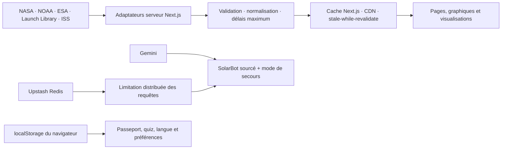

# 🔭 SolarScope — explorer l’Univers, comprendre les données

[](https://github.com/AtomCrtr/SolarScope/actions/workflows/quality.yml)
[](https://github.com/AtomCrtr/SolarScope/actions/workflows/external-resources.yml)
[](https://nextjs.org/)
[](https://www.typescriptlang.org/)
[](https://solar-scope.vercel.app)

**SolarScope est un site éducatif gratuit pour découvrir l’Univers avec des mots simples, de vraies images et des missions courtes.**

Il s’adresse d’abord aux enfants de 6 à 12 ans, mais aussi aux adolescents, aux parents, aux enseignants et à toutes les personnes qui veulent comprendre l’espace sans se perdre dans des explications compliquées.

🌐 **Découvrir SolarScope : [solar-scope.vercel.app](https://solar-scope.vercel.app)**


## D’un projet de fin d’études à une application web complète

SolarScope est né comme **Projet 3, le projet final de fin d’études à la Wild Code School en 2025**. La première version était un tableau de bord data développé avec Python et Streamlit. Des scripts d’ingestion alimentaient une base PostgreSQL hébergée sur Railway à partir de plusieurs API de la NASA.

La version actuelle est une refonte importante, pas un simple changement visuel :

| Projet final d’origine | SolarScope aujourd’hui |
|:---|:---|
| Dashboard Streamlit en Python | Application Next.js 16, React 19 et TypeScript |
| Données copiées dans PostgreSQL/Railway par lots | Sources interrogées côté serveur, normalisées et mises en cache selon leur cadence |
| Navigation orientée analyse de données | Parcours éducatifs par âge, missions et passeport spatial |
| Pages surtout statiques | Données spatiales évolutives, 3D, PWA et fonctionnement dégradé explicite |
| Assistant Gemini expérimental | SolarBot limité, sourcé, protégé et doté d’un mode de secours local |
| Validation manuelle | CI, tests unitaires, tests Playwright, accessibilité et contrôles de production |

Cette évolution conserve l’ADN data du projet initial tout en le transformant en produit web maintenable, documenté et pensé pour un public réel.

## Pourquoi SolarScope existe

L’espace fait rêver, mais il peut aussi sembler immense et difficile à comprendre. Entre les distances gigantesques, les mots scientifiques et les informations qui changent régulièrement, il n’est pas toujours facile de savoir par où commencer.

SolarScope transforme cette découverte en aventure. Chaque sujet part d’une question simple, présente quelques idées importantes, puis propose d’observer, de comparer ou de relever un petit défi.

L’objectif n’est pas de tout apprendre d’un coup. Il est de donner envie de regarder le ciel, de poser des questions et de comprendre progressivement ce que les scientifiques découvrent.

## Ce que l’on peut découvrir

Sur SolarScope, on peut notamment :

- comprendre le Soleil et explorer les huit planètes ;
- suivre les rovers sur Mars et observer Perseverance en 3D ;
- découvrir les astéroïdes, les météorites et les exoplanètes ;
- suivre l’ISS et les prochaines missions spatiales ;
- admirer les images du télescope James-Webb et la photo astronomique du jour ;
- préparer une observation du ciel ;
- répondre à des quiz et remplir un passeport d’explorateur ;
- poser une question à SolarBot et retrouver les sources utilisées.

## Une mission, comment ça marche ?

Chaque parcours est conçu pour être suivi en quelques étapes :

1. **Choisir une mission** selon son âge ou sa curiosité.
2. **Découvrir l’idée essentielle** avec une explication courte.
3. **Observer et manipuler** une image, une comparaison ou une visualisation.
4. **Relever un défi** pour vérifier ce que l’on a compris.
5. **Conserver sa progression** dans son passeport spatial.

On peut lire les missions dans l’ordre ou simplement choisir le sujet qui donne envie aujourd’hui.

## Des informations que l’on peut vérifier

SolarScope s’appuie sur des organismes scientifiques reconnus comme la **NASA**, l’**ESA** et la **NOAA**.

Les chiffres qui évoluent — position de l’ISS, météo solaire, lancements ou découvertes — sont accompagnés de leur source. Lorsqu’une information en direct n’est pas disponible, le site préfère le dire clairement plutôt que d’afficher une estimation comme si elle était certaine.

La page [Données et sources](https://solar-scope.vercel.app/sources) permet de retrouver facilement l’origine des informations.

## Pensé pour les enfants et les familles

- Aucun compte enfant n’est nécessaire.
- Le passeport et la progression restent sur l’appareil utilisé.
- SolarBot rappelle de ne jamais partager son nom, son adresse, son école, son téléphone ou son e-mail.
- Les pages sont utilisables sur ordinateur, tablette et téléphone.
- La navigation est conçue pour rester accessible au clavier et avec les outils d’assistance.

Une page spéciale propose également des repères aux [parents et aux enseignants](https://solar-scope.vercel.app/parents-enseignants) pour accompagner une mission ou lancer une discussion.

## Et la version anglaise ?

Le français est la langue principale de SolarScope. Une présentation de l’accueil est disponible en anglais, mais les parcours pédagogiques détaillés restent actuellement en français.

Ce choix est volontaire : une bonne traduction pour les enfants doit préserver la simplicité des mots et l’exactitude scientifique, pas seulement traduire les phrases mot à mot.

## Liens utiles

- [Explorer SolarScope](https://solar-scope.vercel.app)
- [Commencer par les planètes](https://solar-scope.vercel.app/planetes)
- [Voir son passeport spatial](https://solar-scope.vercel.app/passeport)
- [Consulter les sources scientifiques](https://solar-scope.vercel.app/sources)
- [Lire la politique de confidentialité](https://solar-scope.vercel.app/confidentialite)

## Architecture des données et persistance

La version actuelle **n’a pas de base relationnelle centrale et ne stocke pas de comptes utilisateurs**. Ce choix réduit la collecte de données personnelles et évite de conserver une copie vieillissante de données scientifiques qui disposent déjà de sources de référence.



| Couche | Rôle | Données conservées |
|:---|:---|:---|
| **API scientifiques** | Fournir les données de référence ou évolutives | Aucune copie permanente dans SolarScope |
| **Cache Next.js/Vercel** | Réduire la latence et protéger les services amont | Réponses techniques temporaires, selon la cadence de chaque source |
| **Upstash Redis** | Appliquer un quota partagé aux routes sensibles en production | Compteurs techniques de courte durée, pas de profil utilisateur |
| **localStorage** | Garder l’expérience sans créer de compte | Progression, meilleur score, langue et étape pédagogique sur l’appareil |
| **PostgreSQL/Railway** | Architecture de la première version Streamlit | Héritage du Projet 3, non utilisé par le runtime Next.js actuel |

Lorsqu’une source distante ne répond pas, SolarScope affiche soit la dernière donnée connue avec son statut, soit un état indisponible. Une valeur de secours n’est jamais présentée comme une mesure en direct.

## Sources scientifiques et services

| Source | Utilisation principale |
|:---|:---|
| [NASA Open APIs](https://api.nasa.gov/) | APOD, astéroïdes proches et événements DONKI |
| [NASA Images](https://images.nasa.gov/) | Galerie d’images du télescope James-Webb |
| [NASA Exoplanet Archive](https://exoplanetarchive.ipac.caltech.edu/) | Nombre et catalogue d’exoplanètes confirmées |
| [NASA Science](https://science.nasa.gov/) | Faits de référence sur les planètes, Mars et Webb |
| [NOAA Space Weather Prediction Center](https://www.swpc.noaa.gov/) | Vent solaire, champ magnétique, rayons X et indice Kp |
| [Where the ISS at?](https://wheretheiss.at/) | Position et télémétrie de l’ISS |
| [Launch Library 2](https://thespacedevs.com/llapi) | Prochains lancements spatiaux |
| [Nominatim / OpenStreetMap](https://nominatim.org/) | Nom de la zone d’observation à partir d’une position |
| [Google Gemini](https://ai.google.dev/) | Réponses optionnelles de SolarBot, avec repli local |

Les faits stables et les données en direct sont distingués dans le code par un [registre de sources](src/lib/data/source-registry.ts). Chaque donnée importante peut afficher sa provenance, sa date de vérification et son comportement en cas d’indisponibilité.

## Choix techniques

- **Application** : Next.js 16 App Router, React 19, TypeScript 5
- **Interface** : CSS responsive, Framer Motion, composants accessibles
- **3D** : Three.js, React Three Fiber et Drei
- **Données** : routes serveur Next.js, validation des réponses et cache par source
- **IA** : Gemini côté serveur, réponses de secours, sources et garde-fous enfants
- **Protection** : CSP, en-têtes HTTP, taille maximale des requêtes, délais et quotas Upstash
- **Qualité** : ESLint, TypeScript, Vitest, Playwright et axe-core
- **Déploiement** : Vercel, cron de rafraîchissement et GitHub Actions

## Respect de la vie privée

- Aucun compte enfant n’est demandé.
- La progression reste sur l’appareil et peut être effacée depuis le site.
- SolarBot demande de ne jamais partager nom, adresse, école, téléphone ou e-mail.
- Les clés NASA, Gemini, Redis et cron restent exclusivement côté serveur.
- La politique complète est disponible sur la page [Confidentialité](https://solar-scope.vercel.app/confidentialite).

SolarScope est un projet éducatif indépendant et n’est pas un site officiel de la NASA, de l’ESA, du CNES ou de la NOAA.

## Limites connues

- Le français est la langue principale ; l’anglais reste une prévisualisation partielle.
- Les contenus et flux externes peuvent changer sans préavis malgré les contrôles automatisés.
- Les tests automatisés complètent, mais ne remplacent pas, une validation régulière avec des enfants, parents et enseignants.
- La progression locale ne se synchronise pas entre plusieurs appareils.

## Participer au projet

SolarScope est un projet ouvert aux idées et aux améliorations. Une contribution peut prendre plusieurs formes :

- signaler une explication difficile à comprendre ;
- proposer une nouvelle mission ou une activité ;
- corriger une information ou ajouter une meilleure source ;
- améliorer l’accessibilité ou l’affichage sur mobile ;
- aider à préparer une véritable version anglaise.

Vous pouvez ouvrir une *issue* sur GitHub pour partager une idée ou signaler un problème.

<details>
<summary><strong>Installer le projet pour contribuer</strong></summary>

SolarScope utilise Next.js. Node.js 22 est recommandé ; la version minimale prise en charge est 20.9.

```bash
git clone https://github.com/AtomCrtr/SolarScope.git
cd SolarScope
npm ci
```

Copiez ensuite `.env.example` vers `.env.local`, puis lancez le site :

```bash
npm run dev
```

Le site sera disponible sur [http://localhost:3000](http://localhost:3000).

Avant de proposer une modification, lancez :

```bash
npm run check
npm run test:a11y
npm run check:external
npm run check:production
```

La CI exécute les contrôles de qualité à chaque push et pull request. Un workflow hebdomadaire vérifie aussi les ressources externes et les parcours de production. Dependabot surveille les dépendances npm et les actions GitHub.

Les choix d’organisation du projet sont expliqués dans [docs/ARCHITECTURE.md](docs/ARCHITECTURE.md). Les principes utilisés pour les contenus destinés aux enfants et les données scientifiques se trouvent dans [docs/LEARNING_AND_DATA.md](docs/LEARNING_AND_DATA.md).

</details>

---

**SolarScope invite chacun à lever les yeux, rester curieux et explorer l’Univers une question après l’autre.** 🚀
